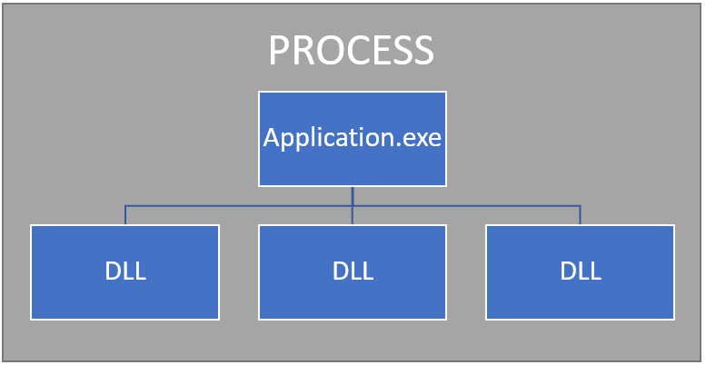
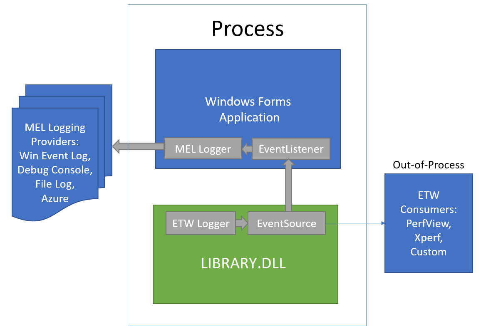
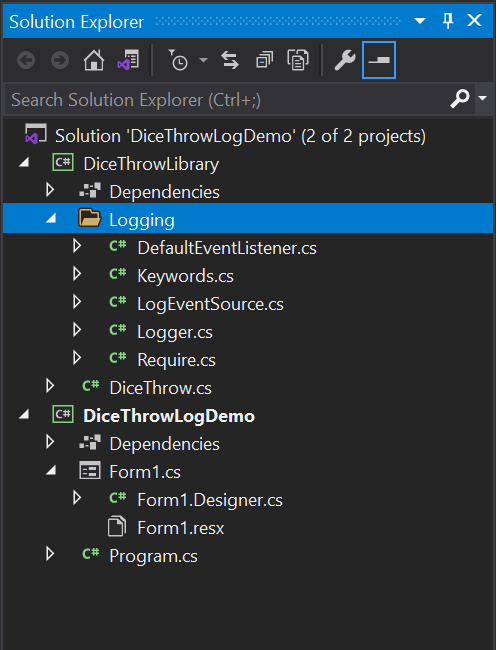
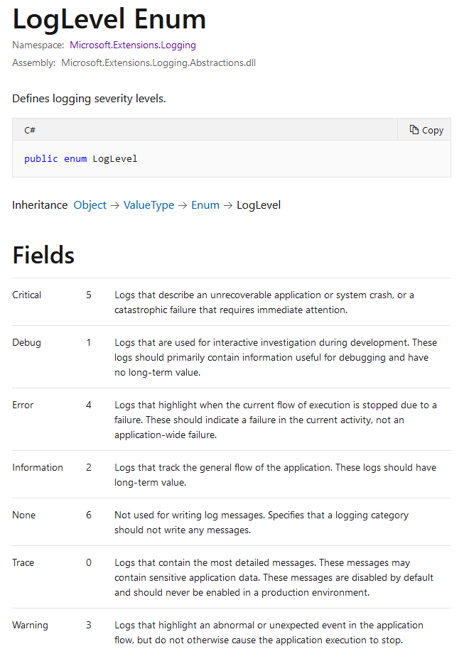
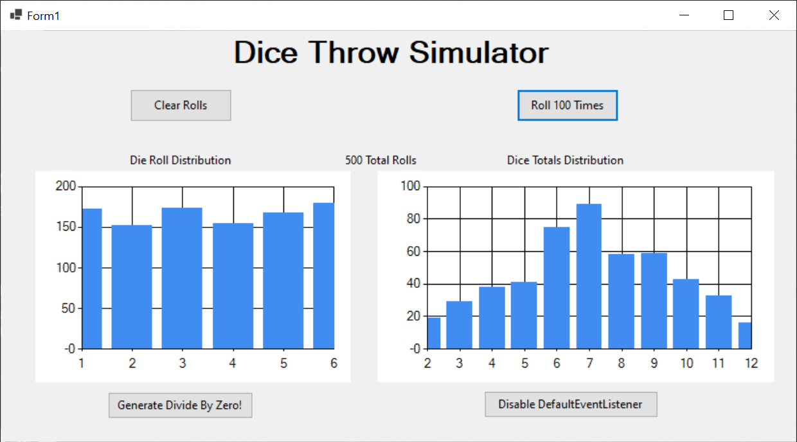
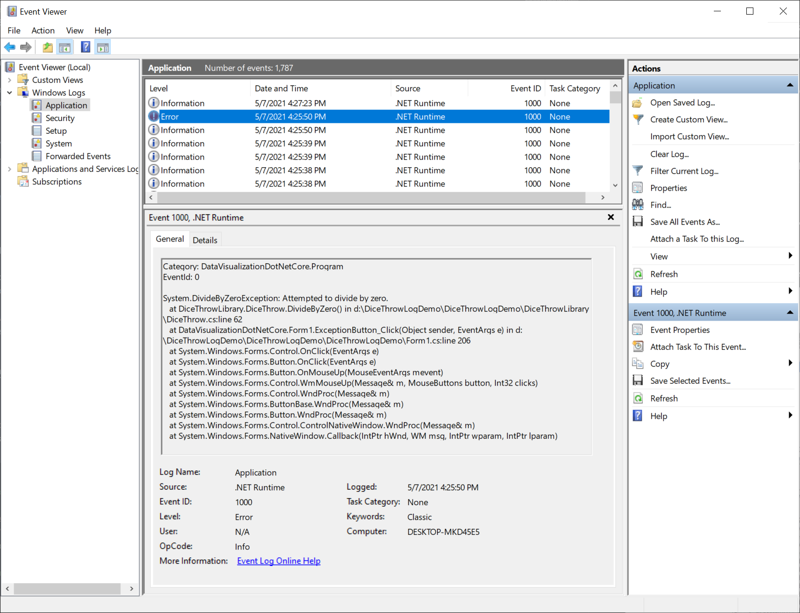

## This project has been modified for use as an ETW source for the DiceThrowService by commenting out all Microsoft.Extensions.Logging code.  For the original logging project, see https://github.com/PaulaScholz/DotNetCoreApplicationLogging

# Application Logging and Library Event Messaging

## Abstract

This project illustrates [Event Tracing for Windows](https://docs.microsoft.com/en-us/windows/win32/etw/event-tracing-portal) (ETW) messaging inside a .Net Core DLL, sending diagnostic messages to an [EventListener](https://docs.microsoft.com/en-us/dotnet/api/system.diagnostics.tracing.eventlistener?view=net-5.0) inside the main application, where they are recorded by a number of log providers using methods in the [Microsoft.Extensions.Logging](https://docs.microsoft.com/en-us/dotnet/core/extensions/logging?tabs=command-line) namespace.

The project makes use of techniques and is derived from code inside a [blog article](https://badecho.com/index.php/2021/01/26/net-library-log/) by [Mr. Matthew Weber](https://badecho.com/index.php/about-omni/), a talented engineer, celebrated game hacker, and founder of Bad Echo, LLC. I have slightly modified and extended his system to marry ETW with `Microsoft.Extensions.Logging`, providing a comprehensive logging system for use in Windows Forms, WPF, and .Net Console applications under .Net Core.

In addition to the logging system, I have provided a logging demonstration program in Windows Forms that uses a newly-ported-to-.Net-5 version of the Windows Forms `System.Windows.Forms.DataVisualization` namespace, which provides charting services to Windows Forms applications. Originally ported from .Net Core 3.0 (preview) to .Net 5 by [Mr. Angelo Cresta](https://github.com/AngeloCresta) as part of an [article](https://www.codeproject.com/Articles/5300595/Winforms-datavisualization-NET-5) for `Code Project`, I have updated that code to build with no warnings under .Net 5 by making minor modifications and removing obsolete code security statements.  That codebase, along with updated Microsoft samples, may be found at my [GitHub repository](https://github.com/PaulaScholz/WindowsFormsDataVisualization). 

## Logging
An Application log is a file or list of a series of events that occur in a computer software application.  Issues will arise during software development and within production environments that can be discovered and corrected through recording events in a log.  Analysis of application logs can provide insights into system performance, bottlenecks, and errors; facilitating diagnosis, correction, and auditing efforts.

Applications on the Windows operating system typically consist of a main application program, represented on disk by an .exe file, and a number of dynamically linked libraries, or DLLs, that provide functional support to the application.  Together, these elements are components of a [Process](https://en.wikipedia.org/wiki/Process_(computing)).



*Process Diagram*

Typically, logging in a process is a function of the Application layer.  DLLs may be built by the same development team as the Application, but they might be developed by a different team altogether, or be a part of the operating system itself. A logging system built for the Application may not be able to expose its logging system to individual DLLs, and events that occur outside the Application but within the same process (such as within a linked DLL), might need to be recorded by a log for reporting to system administrators and developers.

What we've done here is not write our own logging system, rather, we take advantage of the built-in messaging and logging mechanisms provided by .Net for diagnostic purposes.

## Microsoft Logging Systems

Microsoft has made the [Microsoft.Extensions.Logging](https://docs.microsoft.com/en-us/dotnet/core/extensions/logging?tabs=command-line) framework available for use in applications built with .Net. While there are several robust logging frameworks available under .Net, including the generalized logging architecture provided in the `Microsoft.Extensions.Logging` namespace, none of these frameworks are particularly suitable for logging in both an application and its constituent library DLL modules.  Further, several of the traditional Microsoft logging solutions such as Trace Sources in `System.Diagnostics` and `System.Net` namespaces are crippled under .Net Core, and the .Net App.Config file in .Net Core is ignored for both Trace and TraceSource classes.

The `Microsoft.Extensions.Logging` namespace was originally developed for ASP.Net development and is available for .Net Core, but uses dependency injection with Microsoft’s DI framework through a constructor and is difficult to implement in separately compiled library modules. Many projects do not use dependency injection at all. 

A proper library DLL should have little notion of nor dependency upon its application container.  Instead, libraries should send messages to the application layer and the application makes the decision whether, where, and how these messages should be logged.  This is how Microsoft’s UWP Desktop Bridge works, separating background Win32 services from sandboxed UWP code through a local pipe based `AppServiceConnection` using a `ValueSet` messaging object.

Nowhere in Microsoft library code will you see the `Microsoft.Extensions.Logging` framework. It is only implemented by developers at the Application level, by default in an `ASP.Net` solution but also in .Net console, Windows Forms and WPF code through creation of a `LoggerFactory` object.  This logging framework provides application logging services to the Debug provider in Visual Studio, the Console, EventSource objects, the Windows Event log, Azure Application Insights, and several third-party file logging providers such as NLog, Serilog, Log4Net and others. Multiple logging providers may be concurrently enabled at the Application level and called through the `Microsoft.Extensions.Logging` framework.


## Library Messaging System

For libraries, Microsoft relies exclusively on the EventSource object, part of the Windows Management Instrumentation (WMI) [Event Tracing for Windows](https://docs.microsoft.com/en-us/windows/win32/etw/event-tracing-portal) (ETW) system, found in the .Net Core `System.Diagnostics.Tracing` namespace and available under all versions of the Windows operating system since Windows Vista. WMI is the remote management “nervous system” of Windows and ETW is its local messaging component.  ETW is used heavily in performance monitoring applications as it has the lowest latency logging capability within Windows.

ETW is a system-wide local publish/subscribe system, wherein a library module will implement an [EventSource](https://docs.microsoft.com/en-us/dotnet/api/system.diagnostics.tracing.eventsource?view=net-5.0) object and publish messages to out-of-process subscribers through WMI. Subscribers can be both in-process and out-of-process and in-process subscribers (at the application or library level) receive messages through an [EventListener](https://docs.microsoft.com/en-us/dotnet/api/system.diagnostics.tracing.eventlistener?view=net-5.0) class.

ETW is not typically used for inter-process communication purposes, named pipes are the proper mechanism for this locally within a machine, and RPC-derived and Internet protocol methods are used between systems (MSMQ, CORBA, DCOM, SOAP, TCP/IP Sockets, HTTP REST, etc.).  Out-of-process local subscribers such as Microsoft’s [PerfView](https://github.com/Microsoft/perfview) and other performance monitoring applications like the [Windows Performance Toolkit](https://docs.microsoft.com/en-us/windows-hardware/test/wpt/) are beyond the scope of this README.

The relationship between ETW messaging from a DLL, the `Microsoft.Extensions.Logging` framework sending log messages to its providers, and external ETW Event consumers like PerfView or XPerf is shown below:



*ETW-MEL Logging System*

## Inside the DiceThrowLogDemo Visual Studio Solution

In the `DiceThrowLibrary` project, there is a Logging directory that contains all the ETW logging code to be used inside the library.  Within the logging directory, shown below in the Visual Studio Solution Explorer, there are five source files of interest:



*Logging Solution in Visual Studio* 

The first of these, and the one that will be used to write event messages inside the library, is `Logger.cs`.  This file contains the static `Logger` class used to write ETW messages.  There are a number of methods for writing events of interest that mirror the [LogLevel](https://docs.microsoft.com/en-us/dotnet/api/microsoft.extensions.logging.loglevel?view=dotnet-plat-ext-5.0) enumeration of the `Microsoft.Extensions.Logging` (MEL) namespace used at the application layer.  ETW messages are not written to the log inside the library, they are instead published to an `EventListener`-derived class inside the application, where they are then written to the MEL logging providers.  The `LogLevel` enumeration is: 



*Microsoft.Extensions.Logging LogLevel Enumeration*

The static ETW `Logger` class inside the library has a separate method for writing events at each LogLevel, except for the `Trace` level, as well as a `DefaultEventListener` instance used to send ETW messages to any attached debugger, such as the one in Visual Studio.  For example:

```csharp
Logger.Info("Finished the constructor.");
```
will send an Information-level message to the `LogEventSource` which will write an Informational ETW event to the `DefaultEventListener` inside the library (and any attached debugger), to the `EventListener`-derived class inside your application, and to any out-of-process external ETW event consumer applications like `PerfView`.  Other Logger method calls in the library might look like this:

```csharp
Logger.Critical("We're doomed.", argumentException);
Logger.Critical("The computer has been unplugged from the wall!");
Logger.Debug("The answer to life is 42.");
Logger.Error("This does not compute. DOES NOT COMPUTE.");
Logger.Info("Hello there. This is an informational message.");
```
and will yield the following output in the Visual Studio Output window (the Debug console), through the library's `DefaultEventListener` class:

```
01:29 | 27820 | Critical | We're doomed.
    System.ArgumentException: The specified identifier exists, but you were supposed to get it 
    wrong! IDIOT! (Parameter 'identifierValue')
01:29 | 27820 | Critical | The computer has been unplugged from the wall!
01:29 | 27820 | Debug | The answer to life is 42.
01:29 | 27820 | Error | This does not compute. DOES NOT COMPUTE.
01:29 | 27820 | Informational | Hello there. This is an informational message.
```

Note the message output format of Time, ThreadID, Log Level, and Message text.  This output format may be changed by changing the `OnEventWritten` code in your `EventListener`-derived classes.

Once you add the ETW logger code inside your library DLL's solution, you may start using the `Logger` class immediately.  The class is self-initializing and the `Logger` object is static and public.

*Because the `Logger` class is public and static, it may optionally be used at the Application level as well as in the library code, but we recommend that in the Application you use the `Microsoft.Extensions.Logging` methods instead. This allows you to easily distinguish between library and application log messages when analyzing log output.  Of course, you may use them interchangably if you desire, but only `Microsoft.Extensions.Logging` messages are echoed to its logging providers, as we will see shortly.*

## Logging Setup in the Application

ETW provides a robust and fast event messaging solution at the library level, but at the application level we rely on functions in the `Microsoft.Extensions.Logging` (MEL) namespace to write these events to the application log.  MEL provides .Net applications with a framework that supports a variety of built-in and third party logging providers.  

In addition to the logging capability of MEL, we rely on a Windows Forms `Application.ThreadException` handler to catch unhandled exceptions in the application and its constituent library modules, and send these to our logging providers using MEL.

The best way to show how this works is to look at some code.  Below is a listing from our `DiceThrowLogDemo` test program, the Progam.cs file, which shows how MEL's loggging providers are added to the base framework, how `Application.ThreadException` is used, and how log messages are sent to the framework.  The comments are instructive.

The `Microsoft.Extensions.Logging` code is available as a NuGet package.

```csharp
using System;
using System.Windows.Forms;
using Microsoft.Extensions.Logging;
using System.Diagnostics.Tracing;
using DiceThrowLibrary.Logging;

namespace DataVisualizationDotNetCore
{
    /// <summary>
    /// As created by Visual Studio, the Program class is static but for the Microsoft.Extensions.Logging
    /// logger to work correctly, the Program class must not be static. Changing Program to non-static is perfectly fine.
    /// </summary>
    class Program
    {
        // the Microsoft.Extensions.Logging (MEL) logger for this particular Program element.
        // Each Form will have one of these and will create it 
        // in its constructor.
        static private ILogger iMELLogger;

        // the MEL loggerFactory for all Forms, Program, etc. Each
        // Form creates its own logger using this static factory
        static public ILoggerFactory iMELLoggerFactory;

        // the Event Tracing for Windows ETW Listener that receives
        // ETW event messages from the DiceThrowLibrary
        private static EventListenerStub _etwListener;

        /// <summary>
        /// The main entry point for the application.
        /// </summary>
        [STAThread]
        static void Main()
        {
            // to support logging of unhandled exceptions from application and libraries
            Application.ThreadException += Application_ThreadException;

            // System.Diagnostics.Tracing.Eventlistener cannot be created directly,
            // instead a derived class must be created.
            _etwListener = new EventListenerStub();

            // enable listening to the event source in the library.
            _etwListener.EnableEvents(LogEventSource.Instance, EventLevel.LogAlways);

            // Create the logger factory. This is where we add new MEL logging providers
            iMELLoggerFactory = LoggerFactory.Create(builder =>
            {
                builder
                    .AddDebug()
                    .AddEventLog();
            });

            // create the local logger instance for the Program class.  One of these
            // will be created for each Form or other class that does MEL logging
            iMELLogger = iMELLoggerFactory.CreateLogger<Program>();

            // assign the iMELLogger for the Program class to the ETW listener so
            // we can log ETW event messages as well as application events
            _etwListener.iMELLogger = iMELLogger;

            // log our first MEL message to all the logging providers
            iMELLogger.LogInformation("DiceThrowLogDemo started, loggerFactory set up.");


            Application.EnableVisualStyles();
            Application.SetCompatibleTextRenderingDefault(false);
            Application.Run(new Form1());
        }

        /// <summary>
        /// Unhandled exceptions from the application and any linked .Net library bubble up to this handler.
        /// </summary>
        /// <param name="sender"></param>
        /// <param name="e"></param>
        private static void Application_ThreadException(object sender, System.Threading.ThreadExceptionEventArgs e)
        {
            // This will contain the exception message and stack trace. If
            // .pdb files are available, it will also have the line number.
            string logMessage = e.Exception.ToString();

            // write to the Microsoft.Extensions.Logging Program logger;
            if (iMELLogger != null)
            {
                iMELLogger.LogError(logMessage);
            }
        }

        /// <summary>
        /// We must dispose of the ETW listener when Program ends because the ETW EventSource in DiceThrowLibrary uses
        /// unsafe code as ETW is a Win32 framework.
        /// </summary>
        /// <param name="disposing"></param>
        protected virtual void Dispose(bool disposing)
        {
            // we dispose in all cases
            _etwListener.Dispose();
        }

    }

    // Receives ETW logging messages from the library. You cannot use EventListener directly,
    // you must use a derived class, even if it is just a stub.
    sealed public class EventListenerStub : EventListener
    {
        // the Microsoft.Extensions.Logging (MEL) ILogger instance to use when
        // logging events to the MEL logging providers
        public ILogger iMELLogger
        {
            get;
            set;
        }

        /// <summary>
        /// This receives data from the LogEventSource present in DiceThrowLibrary
        /// </summary>
        /// <param name="eventData"></param>
        protected override void OnEventWritten(EventWrittenEventArgs eventData)
        {
            var outputMessage = $@"{eventData.TimeStamp:u} | {eventData.OSThreadId} | {eventData.Level}";

            outputMessage
                = $"{outputMessage} | {(eventData.Payload != null ? eventData.Payload[0] : "Missing message payload.")}";

            if (eventData.Keywords.HasFlag(Keywords.ExceptionKeyword))
            {
                outputMessage = $@"{outputMessage}{Environment.NewLine}    {
                    (eventData.Payload != null ? eventData.Payload[4] : "Missing exception payload.")}";
            }

            // write the ETW event message to the Microsoft.Extensions.Logging framework
            if (iMELLogger != null)
            {
                switch (eventData.Level)
                {
                    case EventLevel.Critical:
                        {
                            iMELLogger.LogCritical(outputMessage);
                            break;
                        }
                    case EventLevel.Error:
                        {
                            iMELLogger.LogError(outputMessage);
                            break;
                        }
                    case EventLevel.Warning:
                        {
                            iMELLogger.LogWarning(outputMessage);
                            break;
                        }
                    case EventLevel.LogAlways:
                    case EventLevel.Informational:
                    case EventLevel.Verbose:
                        {
                            iMELLogger.LogInformation(outputMessage);
                            break;
                        }
                }

            }

            base.OnEventWritten(eventData);
        }
    }
}

```

The first thing we do is attach a handler to the `Application.ThreadException` event.  This handler will be fired each time an unhandled exception occurs in the application or its constituent libraries.  Is is similar to a VB6 `OnError Goto` statement.  In this handler, exception data with stack trace information is sent to each of the MEL logging providers.

Next, we create our ETW event message receiver to handle ETW messages sent from the library DLL.  In that recever, we will build an output message to send to the MEL logging providers.

We then then enable the ETW `EventSource` in the library to begin sending its messages.  ETW messages are not sent by an `EventSource` unless specifically enabled by a consuming ETW listener or out-of-process consumer application.

Next, we create the `iMELLoggingFactory` which will be used to create individual `iMELLogger` instances in each class where we wish to do logging.  We create two default providers, the Debug console, and the Windows Event Log.  We can create additional providers simply by adding them to the list.  See the [Logging providers in .Net](https://docs.microsoft.com/en-us/dotnet/core/extensions/logging-providers) article for a list of available providers.  Some providers may require additional setup or instantiation.

Every time we send a log message with an `iMELLogging` instance, all the logging providers will receive the message and handle it in their own way.  The Debug provider will log the message on the Debug console (Visual Studio Output window) and the EventLog provider will put the event into the Application section of the Windows Event Log.

Using the `iMELLoggingFactory` we create an instance of the `iMELLogger` object to be used inside the Program class.  This will need to be done in each class where you need to do logging.

The next thing we do is attach the created Program.cs `iMELLogger` instance to the `_etwListener` object so it may echo received ETW messages to the MEL logging providers.

We then create our first MEL log message and proceed with the rest of the Windows Forms setup.

Now, let's look at the Dispose method.  It is very simple.

```csharp
        /// <summary>
        /// We must dispose of the ETW listener when Program ends because the ETW EventSource in DiceThrowLibrary
        /// uses unsafe code as ETW is a Win32 framework.
        /// </summary>
        /// <param name="disposing"></param>
        protected virtual void Dispose(bool disposing)
        {
            // we dispose in all cases
            _etwListener.Dispose();
        }
```
When the Windows Forms program ends, `Dispose` will be called by the .Net framework.  Because ETW uses Win32 resources, it must be explicitly disposed at the program's conclusion or memory and handle leaks may occur.

Now we'll look at the `Application.ThreadException` handler, which will be called for all unhandled exceptions in our code.

```csharp
        /// <summary>
        /// Unhandled exceptions from the application and any linked .Net library bubble up to this handler.
        /// </summary>
        /// <param name="sender"></param>
        /// <param name="e"></param>
        private static void Application_ThreadException(object sender, System.Threading.ThreadExceptionEventArgs e)
        {
            // This will contain the exception message and stack trace. If
            // .pdb files are available, it will also have the line number.
            string logMessage = e.Exception.ToString();

            // write to the Microsoft.Extensions.Logging Program logger;
            if (iMELLogger != null)
            {
                iMELLogger.LogError(logMessage);
            }
        }
```
Here, we simply create a log message using the Exception.ToString() method and send it to the `iMELLogger` object if it exists.  The unhandled exception will then be sent to the Debug console and Windows Event Log.  In Release mode, the application will continue to be run unless explicitly terminated. In Debug mode, the application will break at the source of the exception, but may be resumed by pressing `Continue` in Visual Studio. See [Application.ThreadException](https://docs.microsoft.com/en-us/dotnet/api/system.windows.forms.application.threadexception?view=net-5.0) for more details on unhandled exceptions and how to deal with them.  You may wish to expand on this mechanism for individual applications.

Finally, we have the ETW `EventListener`-derived class.  You cannot create an `EventListener` class directly, it must be a derived class.  Your application can have more than one `EventListener`-derived class, one for each `EventSource` you wish to monitor, for example, one for each constituent library DLL.  They will all be handled the same way.

```csharp
    // Receives ETW logging messages from the library. You cannot use EventListener directly,
    // you must use a derived class, even if it is just a stub.
    sealed public class EventListenerStub : EventListener
    {
        // the Microsoft.Extensions.Logging (MEL) ILogger instance to use when
        // logging events to the MEL logging providers
        public ILogger iMELLogger
        {
            get;
            set;
        }

        /// <summary>
        /// This receives data from the LogEventSource present in DiceThrowLibrary
        /// </summary>
        /// <param name="eventData"></param>
        protected override void OnEventWritten(EventWrittenEventArgs eventData)
        {
            var outputMessage = $@"{eventData.TimeStamp:u} | {eventData.OSThreadId} | {eventData.Level}";

            outputMessage
                = $"{outputMessage} | {(eventData.Payload != null ? eventData.Payload[0] : "Missing message payload.")}";

            if (eventData.Keywords.HasFlag(Keywords.ExceptionKeyword))
            {
                outputMessage = $@"{outputMessage}{Environment.NewLine}    {
                    (eventData.Payload != null ? eventData.Payload[4] : "Missing exception payload.")}";
            }

            // write the ETW event message to the Microsoft.Extensions.Logging framework
            if (iMELLogger != null)
            {
                switch (eventData.Level)
                {
                    case EventLevel.Critical:
                        {
                            iMELLogger.LogCritical(outputMessage);
                            break;
                        }
                    case EventLevel.Error:
                        {
                            iMELLogger.LogError(outputMessage);
                            break;
                        }
                    case EventLevel.Warning:
                        {
                            iMELLogger.LogWarning(outputMessage);
                            break;
                        }
                    case EventLevel.LogAlways:
                    case EventLevel.Informational:
                    case EventLevel.Verbose:
                        {
                            iMELLogger.LogInformation(outputMessage);
                            break;
                        }
                }

            }

            base.OnEventWritten(eventData);
        }
    }
```
Here in the `OnEventWritten` override, we create a log message from the EventData, add any additional payload or exception data, and pass the message onto the `iMELLogging` provider according to its EventLevel.  Remember to call the base class.


## Using Microsoft.Extensions.Logging in Application Classes

So far, we've seen how to set up Microsoft ETW and Extensions logging in the main Program class of our application, setting up the ETW `EventListener` to receive ETW events from your DLL, writing those messages to the MEL log, and sending standard log messages to the MEL log providers. Now, we're going to bring this together to use the MEL logger in your application classes.

We're going to use a Windows Forms Form-derived class as our example.  We need to provide a `using` reference statement to the `Microsoft.Extensions.Logging` namespace and declare a static instances of `iMELLogger`, like this:

```csharp
using Microsoft.Extensions.Logging;

        .............

        // the Microsoft.Extensions.Logging (MEL) logger for this particular form
        private static ILogger iMELLogger;
```

Next, we need to use the applcation's static instance of the `iMELLoggerFactory` to create a logger for the Form inside the Form constructor, like this:

```csharp
        public Form1()
        {
            InitializeComponent();

            // create the logger for this particular form
            iMELLogger = Program.iMELLoggerFactory.CreateLogger<Form1>();

            Load += Form1_Load;
            FormClosing += Form1_FormClosing;
            
        }
```
Notice how we create the logger using the class name of the Form-derived instance?  This will help us identify logging messages that originate from this Form1 instance in the log output.

Now, we use the `iMELLogger` instance anywhere in our Form1 code, like this:

```csharp
        private void Form1_FormClosing(object sender, FormClosingEventArgs e)
        {
            iMELLogger.LogInformation("Form1 is closing.");
        }    
```

This will result in a log message inside the log providers like this, from the Visual Studio Output window:

```
DataVisualizationDotNetCore.Form1: Information: Form1 is closing.
```
Note the program name and class name, log level, and message contents.  

Now, we'll look at the entire log output of the `DiceThrowLogDemo` test program, which looks like this:



  The log output will contain a mix of ETW messages from the library and `iMELLogger` messages from the main application.  We'll start the program, do a few hundred dice rolls, then deliberately generate an unhandled exception to see how the `Application.ThreadException` handler intercepts and reports the exception event.

Here is the Visual Studio Output window log output from the run:

```
DataVisualizationDotNetCore.Program: Information: DiceThrowLogDemo started, loggerFactory set up.
DataVisualizationDotNetCore.Form1: Information: Just set up the chart controls inside SetupChart().
DataVisualizationDotNetCore.Form1: Information: Form1_Load completed.
23:25 | 26600 | Informational | DiceThrowLibrary has generated 100 total throws this run.
DataVisualizationDotNetCore.Program: Information: 2021-05-07 23:25:33Z | 26600 | Informational | DiceThrowLibrary has generated 100 total throws this run.
DataVisualizationDotNetCore.Form1: Information: AddRolls_Click completed.
23:25 | 26600 | Informational | DiceThrowLibrary has generated 200 total throws this run.
DataVisualizationDotNetCore.Program: Information: 2021-05-07 23:25:35Z | 26600 | Informational | DiceThrowLibrary has generated 200 total throws this run.
DataVisualizationDotNetCore.Form1: Information: AddRolls_Click completed.
23:25 | 26600 | Informational | DiceThrowLibrary has generated 300 total throws this run.
DataVisualizationDotNetCore.Program: Information: 2021-05-07 23:25:36Z | 26600 | Informational | DiceThrowLibrary has generated 300 total throws this run.
DataVisualizationDotNetCore.Form1: Information: AddRolls_Click completed.
23:25 | 26600 | Informational | DiceThrowLibrary has generated 400 total throws this run.
DataVisualizationDotNetCore.Program: Information: 2021-05-07 23:25:38Z | 26600 | Informational | DiceThrowLibrary has generated 400 total throws this run.
DataVisualizationDotNetCore.Form1: Information: AddRolls_Click completed.
23:25 | 26600 | Informational | DiceThrowLibrary has generated 500 total throws this run.
DataVisualizationDotNetCore.Program: Information: 2021-05-07 23:25:39Z | 26600 | Informational | DiceThrowLibrary has generated 500 total throws this run.
DataVisualizationDotNetCore.Form1: Information: AddRolls_Click completed.
DataVisualizationDotNetCore.Form1: Information: ExceptionButton_Click about to generate DivideByZero exception.
Exception thrown: 'System.DivideByZeroException' in DiceThrowLibrary.dll
DataVisualizationDotNetCore.Program: Error: System.DivideByZeroException: Attempted to divide by zero.
   at DiceThrowLibrary.DiceThrow.DivideByZero() in d:\DiceThrowLogDemo\DiceThrowLogDemo\DiceThrowLibrary\DiceThrow.cs:line 62
   at DataVisualizationDotNetCore.Form1.ExceptionButton_Click(Object sender, EventArgs e) in d:\DiceThrowLogDemo\DiceThrowLogDemo\DiceThrowLogDemo\Form1.cs:line 206
   at System.Windows.Forms.Control.OnClick(EventArgs e)
   at System.Windows.Forms.Button.OnClick(EventArgs e)
   at System.Windows.Forms.Button.OnMouseUp(MouseEventArgs mevent)
   at System.Windows.Forms.Control.WmMouseUp(Message& m, MouseButtons button, Int32 clicks)
   at System.Windows.Forms.Control.WndProc(Message& m)
   at System.Windows.Forms.ButtonBase.WndProc(Message& m)
   at System.Windows.Forms.Button.WndProc(Message& m)
   at System.Windows.Forms.Control.ControlNativeWindow.WndProc(Message& m)
   at System.Windows.Forms.NativeWindow.Callback(IntPtr hWnd, WM msg, IntPtr wparam, IntPtr lparam)
The thread 0x441c has exited with code 0 (0x0).
DataVisualizationDotNetCore.Form1: Information: Form1 is closing.
The program '[26120] DiceThrowLogDemo.exe' has exited with code 0 (0x0).
```

The first log message is from the `iMELLogger` inside the Program.cs constructor, telling us we've created the logger factory and logged our first message. The second and thrid messages are from the `Form1` class, reporting setup of the chart controls and the `Form1_Load` event.

But what is the fourth message?  It doesn't seem to have any source information.  This message is an ETW message echoed to the Visual Studio Debug console (the Output window) from the `DefaultEventListener` inside the ETW logging code in our DLL.  We can turn these default messages off simply by calling the `Logger.DisableDefaultListener` method. The `EventSouce` will still be enabled by our application code when we create our `_etwListener` using the EnableEvents method of the Application's `_etwListener` instance, as we do in Program.cs.

We have exposed this capability from the `DiceThrowLibrary` with two public methods:
 
```csharp
        /// <summary>
        /// This method disables the DefaultEventListener which will suppress library ETW messages
        /// from appearing on attached debuggers.  Logger ETW messages will still be sent to any
        /// enabled application EventListener.
        /// </summary>
        public static void DisableDefaultEventListener()
        {
            Logger.DisableDefaultListener();
        }

        /// <summary>
        /// This method enables the DefaultEventListener to generate library ETW messages
        /// that will then appear on attached debuggers. The DefaultEventListener is enabled
        /// by default. Logger ETW messages are always sent to any enabled application EventListener.
        /// </summary>
        public static void EnableDefaultEventListener()
        {
            Logger.EnableDefaultListener();
        }
```

You may see and test this capability from the demonstration progam user interface by toggling the `Disable/Enable DefaultEventListener` button.

The fifth log entry is that same ETW message, but logged to MEL providers through the Program class' `iMELLogger` instance.  You will see a mix of ETW and MEL logger messages throughout the log if you do not disable the DefaultEventListener.  ETW messages recorded by the MEL logger will have their class origin on the line, as well as the contents of the ETW message (including time stamp, thread ID, log level, and message). Log entries that look like this are from the ETW system, echoed through MEL:

```
DataVisualizationDotNetCore.Program: Information: 2021-05-07 23:25:33Z | 26600 | Informational | DiceThrowLibrary has generated 100 total throws this run.
```

## Logging Exception Occurences

Notice that in our log above, we see an Exception.  This exception was deliberately generated inside our library by our test code and was not handled by a `try/catch` block.  Thus, it was passed to the `Application.ThreadException` event handler, which is called for all unhandled exceptions in our application and constituent library DLLs.

Note that we get a complete stack trace, and if we have Program Debug Database (.pdb) files from building a Debug version of the application in the same location as the application's .exe and .dll files, we get the offending line number.

Because we have enabled the `Windows Event Log` provider in our `iMELLoggerFactory` instantiation, log messages and exceptions are recorded in the Windows Event Log.  Here is a screenshot from the Windows Event Log for our test divide-by-zero exception:



*Windows Event Log*

Note that inside our `Application.ThreadException` event handler, we have called the `iMELLogger` LogError method, thus the Windows Event Log records this event with the Error level.

In a Release build, program execution will continue from this exception handler.  In a Debug build, the program will break on the exception and execution may be resumed by pressing the `Continue` button in the Visual Studio user interface.

```csharp
        /// <summary>
        /// Unhandled exceptions from the application and any linked .Net library bubble up to this handler.
        /// </summary>
        /// <param name="sender"></param>
        /// <param name="e"></param>
        private static void Application_ThreadException(object sender, System.Threading.ThreadExceptionEventArgs e)
        {
            // This will contain the exception message and stack trace. If
            // .pdb files are available, it will also have the line number.
            string logMessage = e.Exception.ToString();

            // write to the Microsoft.Extensions.Logging Program logger;
            if(iMELLogger != null)
            {
                iMELLogger.LogError(logMessage);
            }     
        }
```

## Frequently Asked Questions

*The Form1 class uses the ILogger iMELLogger. Is this iMELLogger a publisher or subscriber?*

The `iMELLogger` does not subscribe to the LogEventSource. That is the job of the derived `EventListener` class, EventListenerStub, which is instantiated as the `_etwListener` inside the Program.Main() method and subscribed to the LogEventSource using the method *EnableEvents(LogEventSource.Instance, EventLevel.LogAlways)* call.  
 
Inside that EventListenerStub class is an event handler method override called `OnEventWritten` which is the method that actually receives event messages from the LogEventSource in the library.  Those are then echoed to the Program class’s `iMELLogger` instance depending on event level.  Recall, inside Program.Main() we set the EventListenerStub’s reference to the `iMELLogger` created with the LoggerFactory so *EventListenerStub.OnEventWritten* can call the `Program.iMELLogger` with event messages received from the LogEventSource.

*The _etwListener is a subscriber of the LogEventSource, is this correct?*

Yes, this is exactly how that works.

*Is this iMELLogger a publisher or subscriber?*

The `iMELLogger` is a “publisher” to its logging providers, currently the Debug console and the Windows Event Log, established when we created the LoggingFactory in Program.Main().  It receives ETW messages echoed from the EventListenerStub’s `OnEventWritten` method and inside the case statement calls the appropriate `iMELLogger` method to write them to the MEL logging providers.

*Can the MEL logger publish to Azure Application Insights?*

It certainly can.  The Azure Application Insights NuGet package needs to be installed, and that provider needs to be added to the iMELLoggingFactory creation in Progam.Main().  Of course, you will need an account on Azure to do this, and need to register your application program as an Azure Application Insights application.  Azure Application Insights is available for both web and desktop applications.  You may find more information here:  https://docs.microsoft.com/en-us/azure/azure-monitor/azure-monitor-app-hub

