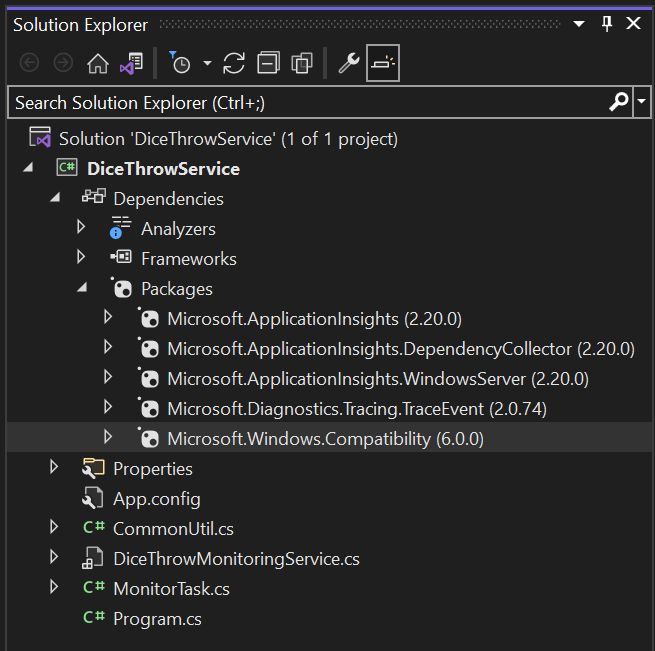

# Windows Event Logging with Application Insights

## Abstract
This project illustrates a [Windows Service application](https://docs.microsoft.com/en-us/dotnet/framework/windows-services/introduction-to-windows-service-applications) that listens to events from an [Event Tracing for Windows](https://docs.microsoft.com/en-us/windows/win32/etw/event-tracing-portal) (ETW) provider and logs the trace event messages to [Azure Application Insights](https://docs.microsoft.com/en-us/azure/azure-monitor/app/app-insights-overview) as well as the [Windows Event Log](https://docs.microsoft.com/en-us/windows/win32/eventlog/event-logging).  The use of `Application Insights` provides an online alternative to the [Windows Event Viewer](https://docs.microsoft.com/en-us/host-integration-server/core/windows-event-viewer1) for viewing and manipulating these logs.

While all the code is written in the latest version of .Net (version 6 at the time of writing), we specifically ***do not*** use the [.Net BackgroundService](https://docs.microsoft.com/en-us/dotnet/core/extensions/windows-service) techniques for creating a Windows Service.  Rather, this project uses the [Windows Compatability Pack](https://docs.microsoft.com/en-us/dotnet/core/porting/windows-compat-pack) to provide a partial implementation of the .Net Framework [ServiceBase](https://docs.microsoft.com/en-us/dotnet/api/system.serviceprocess.servicebase?view=dotnet-plat-ext-6.0) class, allowing us to override the `OnStart` and `OnStop` methods of that class, just as in a .Net Framework-derived or Win32 Windows Service.

## Background
If you are testing components in a Windows Virtual Machine (VM) or on the desktop, sometimes you might want to look at events generated by by user-mode application libraries, key Windows components, or kernel-level drivers. Typically, these events are emitted by an [EventSource](https://docs.microsoft.com/en-us/dotnet/api/system.diagnostics.tracing.eventsource?view=net-6.0) in code instrumented with ETW, and consumed using Windows utilities like [Logman](https://techcommunity.microsoft.com/t5/ask-the-performance-team/two-minute-drill-logman-exe/ba-p/373061), [PerfView](https://docs.microsoft.com/en-us/dynamics-nav/how-to--use-perfview-to-collect-event-trace-data), the [Windows Performance Analyzer](https://docs.microsoft.com/en-us/windows-hardware/test/wpt/), PowerShell, or the Windows Event Viewer.  A recent and easy-to-understand [primer](https://nasbench.medium.com/a-primer-on-event-tracing-for-windows-etw-997725c082bf) on ETW is available online and merits your attention if you are unfamiliar with this technology.  

While Azure itself has a mechanism for collecting ETW events using [Log Analytics](https://docs.microsoft.com/en-us/azure/azure-monitor/agents/data-sources-event-tracing-windows), you might want to do some processing on these events on the local VM or machine under test before you send them to Azure. To this end, we have developed a Windows Service that listens to an ETW provider and allows you to modify or process these events locally before they are echoed to Azure Application Insights.  Sending events to Application Insights obviates the need to download event files from the test machine or VM for analysis.

This project uses code to generate ETW events from an earlier [logging demo](https://github.com/PaulaScholz/DotNetCoreApplicationLogging) that uses the [Microsoft.Extensions.Logging](https://docs.microsoft.com/en-us/dotnet/core/extensions/logging?tabs=command-line) namespace. Specifically, we use the `DiceThrowLibrary` and `Dice Throw Simulator` Winforms application, written using .Net 5, to generate our ETW events.  All code using `Microsoft.Extensions.Logging` in that demo has been commented out and we only use ETW to generate events for consumption by our Windows Service.  Note that you can also use `Microsoft.Extensions.Logging` to echo log messages to Application Insights from an application program, but using a Windows Service provides flexibilty to manage this process from a command prompt or PowerShell.

## Architecture
For library logging, Microsoft relies exclusively on the EventSource object, part of the Windows Management Instrumentation (WMI) [Event Tracing for Windows](https://docs.microsoft.com/en-us/windows/win32/etw/event-tracing-portal) (ETW) system, found in the .Net `System.Diagnostics.Tracing` namespace and available under all versions of the Windows operating system since Windows Vista. WMI is the remote management “nervous system” of Windows and ETW is its local messaging component.  ETW is used heavily in performance monitoring applications as it has the lowest latency logging capability within Windows.

ETW is a system-wide local publish/subscribe system, wherein a library module will implement an [EventSource](https://docs.microsoft.com/en-us/dotnet/api/system.diagnostics.tracing.eventsource?view=net-5.0) object and publish messages to out-of-process subscribers through WMI. Subscribers can be both in-process and out-of-process and in-process subscribers (at the application or library level) receive messages through an [EventListener](https://docs.microsoft.com/en-us/dotnet/api/system.diagnostics.tracing.eventlistener?view=net-5.0) class.

ETW is not typically used for inter-process communication purposes, named pipes are the proper mechanism for this locally within a machine, and RPC-derived and Internet protocol methods are used between systems (MSMQ, CORBA, DCOM, SOAP, TCP/IP Sockets, HTTP REST, etc.).  Out-of-process local subscribers such as Microsoft’s [PerfView](https://github.com/Microsoft/perfview) and other performance monitoring applications like the [Windows Performance Toolkit](https://docs.microsoft.com/en-us/windows-hardware/test/wpt/) are beyond the scope of this README.

The relationship between ETW messaging from a DLL or application, and external ETW Event consumers like PerfView, the Windows Performance Toolkit, or this Windows Service ETW consumer is shown below:


In this project, we are building a Windows Service as an ETW-consumer application that will echo received messages from an ETW provider to Azure Application Insights.  First, we will discuss the C# project for the windows service, PowerShell commands for starting and stopping the service, and then we will discuss setting up `Azure Application Insights` to receive and display the messages.  Finally, we will briefly discuss the source of the ETW messages, the `Dice Throw Simulator` portion of our original [logging project](https://github.com/PaulaScholz/DotNetCoreApplicationLogging).

## ETW-consumer Windows Service (DiceThrowService)
This is a standard Windows Service that was originally developed for the .Net Framework version 4.8, but has been converted to use .Net version 6 using the latest verion of the [Windows Compatability Pack](https://docs.microsoft.com/en-us/dotnet/core/porting/windows-compat-pack). An excellent discussion on the design philosophy behind the pack may be found at this [GitHub page](https://github.com/dotnet/designs/blob/main/accepted/2018/compat-pack/compat-pack.md). 

The Visual Studio solution of the service is below:



Note that at the time of writing, the Windows Compatability Pack is not available via the `Manage NuGet Packages` window in Visual Studio, but must be installed by hand in the `Package Manager Console` window, available from the Visual Studio Tools menu, like this:

```dotnetcli
Install-Package Microsoft.Windows.Compatibility -Version 6.0.0
```
There are five source files of interest.  The first of these is `Program.cs`, shown below.  Note that it uses the new console template for .Net 6 and does not require an internal Program class as previous versions.

```csharp
// See https://aka.ms/new-console-template for more information
using DiceThrowService;

System.ServiceProcess.ServiceBase.Run(new DiceThrowMonitoringService());

```
Next is the `DiceThrowMonitoringService.cs` file, which implements [ServiceBase](https://docs.microsoft.com/en-us/dotnet/api/system.serviceprocess.servicebase?view=dotnet-plat-ext-6.0).  When the service is started from the [Windows Service Control Manager](https://docs.microsoft.com/en-us/windows/win32/services/service-control-manager), the `OnStart` override of `ServiceBase` is called and we simply start a new async thread running the `MonitorTask.StartTask` method, which starts a `TraceEventSession` from the [Microsoft Trace Event Library](https://devblogs.microsoft.com/dotnet/announcing-traceevent-monitoring-and-diagnostics-for-the-cloud/).

```csharp
        /// Called when the service is started.
        /// </summary>
        /// <param name="args"></param>
        protected override async void OnStart(string[] args)
        {
            base.OnStart(args);

            // start the MonitorTask
            try
            {
                MonTask = new MonitorTask(this);

                // start monitoring
                await Task.Run(() => MonTask.StartTask());
            }
            catch
            {
                Debug.WriteLine("A MonitorTask error occured in the DiceThrowService.");
            }
        }
```
The use of a separate object and thread allows the service's async `OnStart` method to return immediately and the `MonitorTask.OnStart` continues to process ETW events until the task is canceled when the service is stopped.  From `MonitorTask.cs`:
```csharp
    internal class MonitorTask
    {
        private TraceEventSession? Session;
        private readonly DiceThrowMonitoringService? Parent;

        public MonitorTask(DiceThrowMonitoringService parent)
        {
            Parent = parent;
        }

        /// <summary>
        /// Start the task, it is async so the service doesn't hang in OnStart.
        /// </summary>
        /// <returns>Task</returns>
#pragma warning disable CS1998 // Async method lacks 'await' operators and will run synchronously
        public async Task StartTask()
#pragma warning restore CS1998 // Async method lacks 'await' operators and will run synchronously
        {
            Session = new TraceEventSession(CommonUtil.GetTraceEventSessionName());

            // subscribe to all events in the source through
            // the default DynamicTraceEventParser
            Session.Source.Dynamic.All += Source_AllEvents;

            // turn on the ETW Provider
            Session?.EnableProvider(Parent?.EtwProviderName);

            // process ETW events forever until cancelled in CancelTask
            Session?.Source.Process();
        }
```

The ETW Provider we are monitoring is a self-describing dynamic provider where its manifest is built into the ETW event itself. Thus, we use the TraceEvent library's `DynamicTraceEventParser` to decode the events.

ETW events from the provider will continue to be processed until the Windows service is stopped. Inside `DiceThrowMonitoringService.cs`, we override the `ServiceBase` OnStop() method:
```csharp
        /// <summary>
        /// Stop the service.
        /// </summary>
        protected override void OnStop()
        {
            base.OnStop();

            // Cancel monitoring, destroy the TraceEventSession
            MonTask?.CancelTask();
            MonTask = null;

            // before exit, flush the remaining telemetry data
            ServiceTelemetryClient.Flush();

            // flush is not blocking when not using InMemoryChannel so wait a bit. There is an active issue regarding the need for `Sleep`/`Delay`
            // which is tracked here: https://github.com/microsoft/ApplicationInsights-dotnet/issues/407
            Task.Delay(5000).Wait();
        }
```
And inside the `MonitorTask`:
```csharp
        /// <summary>
        /// Disable the ETW provider, stop the session and destroy it.
        /// </summary>
        public void CancelTask()
        {
            // turn off the ETW provider
            Session?.DisableProvider(Parent?.EtwProviderName);

            // kill the session
            Session?.Stop();
            Session?.Dispose();
            Session = null;
        }
```
Options used by the Windows service are in the `App.config` file, which looks like this:
```xml
<?xml version="1.0" encoding="utf-8" ?>
<configuration>
  <appSettings>
    <!-- Put your service name here. It will appear in the list of services in Services.msc -->
    <add key="ServiceName" value="DiceThrowService"/>
    <!-- This is the GUID or name of the ETW provider you wish to monitor. -->
    <add key="EtwProviderName" value="DiceThrowLog"/>
    <!-- True will log all events received from the ETW provider, False will only log certain events in WriteEvent() -->
    <add key="AllEventsFlag" value="True"/>
    <!-- The name of your Trace Event Session, one for each provider. In future, there may be more than one. -->
    <add key="TraceEventSessionName" value="DiceThrowMonitor"/>
    <!-- The GUID of your Application Insights ID. Change for your own instance. Allows write-access to Azure Application Insights. -->
    <add key="AppInsightsInstrumentationKey" value="Your-App-Insights-Key-Here"/>
  </appSettings>
</configuration>
```
- The `ServiceName` is the name of the service as it will appear in any list of services from PowerShell or Services.msc.  
- The `EtwProviderName` is the GUID or name of the ETW provider you wish to monitor.
- The `AllEventsFlag` may be used to gate which events are fired in `DiceThrowMonitoringService.WriteEvent` method, if desired.
- The `TraceEventSessionName` specifies the name of this `TraceEventSesion`.  You may have more than one if you want to monitor multiple ETW providers in the future.
- The `AppInsightsInstrumentationKey` is the GUID of your Azure Application Insights ID and allows write-access to Application Insights.

Finally, `CommonUtil.cs` contains utility functions for retrieving these settings from the `App.config` file.

## Application Insights 
Microsoft developed [Application Insights](https://docs.microsoft.com/en-us/azure/azure-monitor/app/app-insights-overview) primarily as an application performance management system for monitoring live web apps for availability, performance, and usage.  However, it can also be used by [.Net console applications](https://docs.microsoft.com/en-us/azure/azure-monitor/app/console) like our ETW-event logging Windows Service.  Here, we use it to log ETW trace messages from software under test, either in a Virtual Machine or locally.

There are two major ways to create Application Insights resources: [Classic](https://docs.microsoft.com/en-us/azure/azure-monitor/app/create-new-resource) or [Workspace-based](https://docs.microsoft.com/en-us/azure/azure-monitor/app/create-workspace-resource).  The Classic Application Insights offering has been deprecated and will be retired on 29 February 2024, however this project was built for Classic Application Insights and its simpler set-up and limited feature set is more suitable for our type of application logging. However, there are ample [instructions to migrate](https://docs.microsoft.com/en-us/azure/azure-monitor/app/convert-classic-resource) your Classic AI resources to the Workplace-based offering. 

ETW Trace logs from Application Insights using this service mirror their Windows Event viewer counterparts and may be accessed directly on the Microsoft Azure portal using the Transaction Search option of the Investigate section, as shown below.


Notice that each trace tranaction has a counterpart in the Windows Event Viewer and we can see individual data elements for a selected trace in the details pane below the event list.


## Publish, Install, Start and Stop the Windows Service
To create the Windows Service in Visual Studio, it is recommended that the app be [published](https://docs.microsoft.com/en-us/dotnet/core/extensions/windows-service) as a single-file executable.  The resulting *.exe file can be targeted by the Windows Service Control Manager.


Now that the service has been published, it must be created as a Windows Service using the Service Control Manager in PowerShell or an administrative command prompt.  You must use Administrator credentials when working with a Windows Service in this manner.  A complete guide to creating, starting, stopping, and deleting a Windows Service through the Service Control Manager is [available online](https://docs.microsoft.com/en-us/dotnet/core/extensions/windows-service).  

## Generating ETW Events - Dice Throw Simulator
The ETW events for this example application were generated by the Dice Throw Simulator application, developed for my [Application and Library Event Messaging](https://github.com/PaulaScholz/DotNetCoreApplicationLogging#application-logging-and-library-event-messaging) GitHub sample project. That project primarily uses the `Microsoft.Extensions.Logging` framework to echo ETW messages from the `DiceThrowLibrary.dll`  to any number of .Net logging providers, but in this sample we have removed `Microsoft.Extensions.Logging` functionality by commenting out the appropriate source statements. The modified source code for that sample is included in this repository.


An ETW event is generated for the `DiceThrowLog` when the application is started, each time the *Roll 100 Times* button is pressed, and when the application ends.  